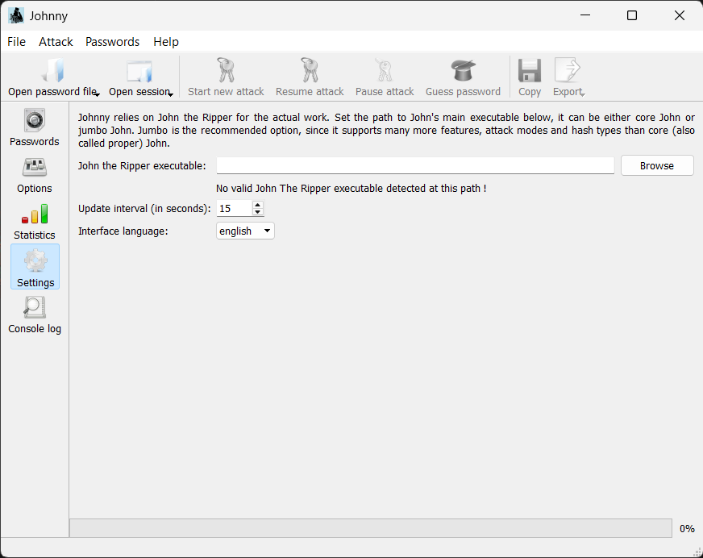
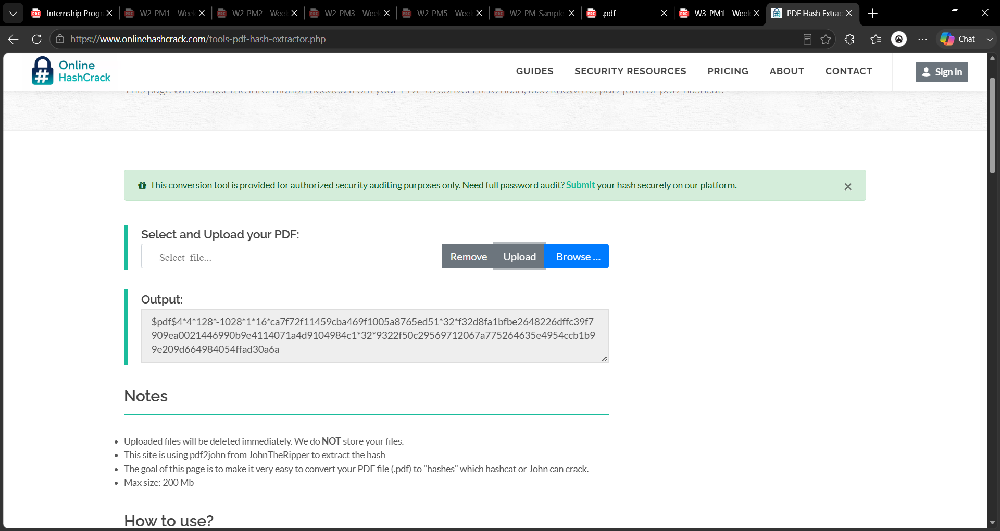
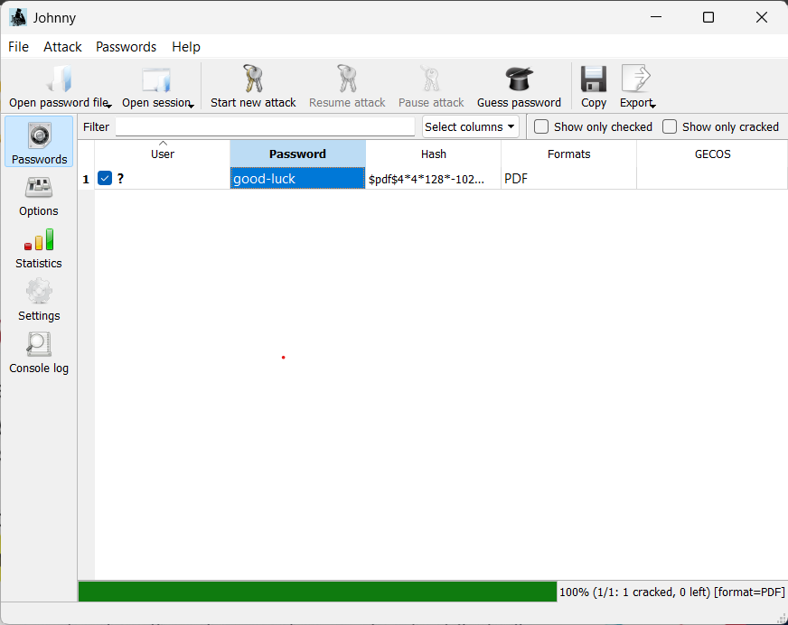
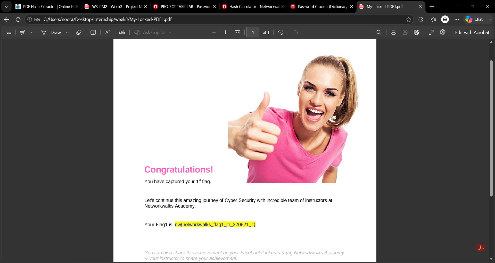
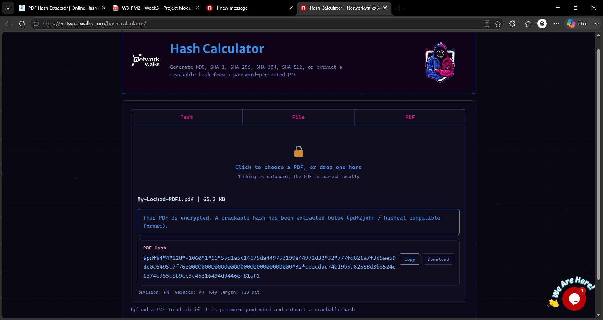
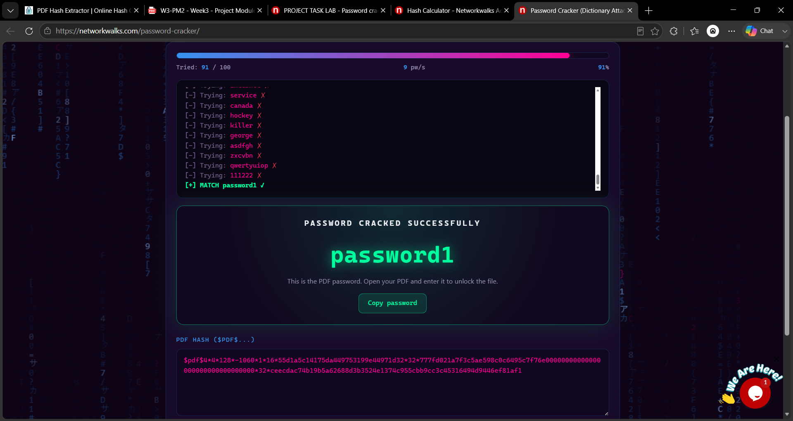
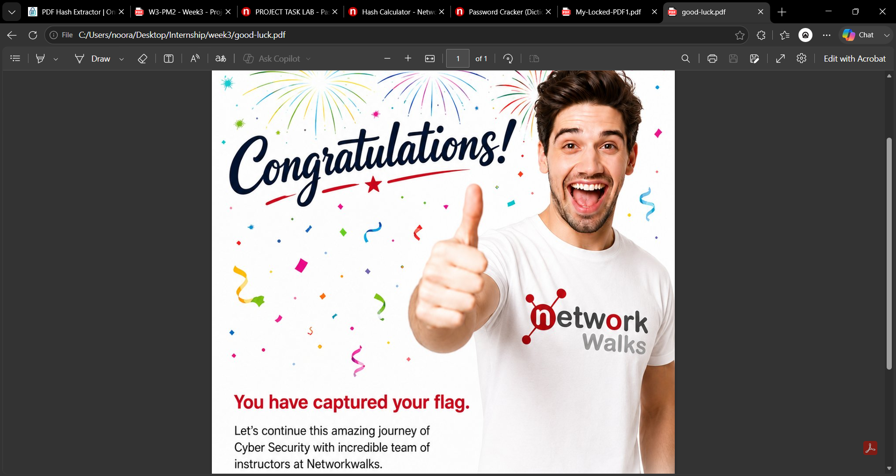

# Password Cracking Lab Report

**Course:** Cybersecurity & Ethical Hacking — Week 3
**Modules covered:**
- Project Module 1 — Password Cracking with JTR (John the Ripper / Johnny)
- Project Module 2 — Password Cracking with Networkwalks Tools (Hash Calculator / Password Cracker)

**Target file:** `My-Locked-PDF1.pdf`

---

## Overview

The goal of both lab modules was to recover the password of the same encrypted PDF file, `My-Locked-PDF1.pdf`, using two different approaches:

1. **Module 1** — Extract the PDF's password hash and crack it locally using **John the Ripper (JTR)** through its GUI front-end, **Johnny**.
2. **Module 2** — Extract the same hash and crack it using the online **Networkwalks Hash Calculator** and **Password Cracker** tools.

Both methods work the same way in principle: the password protecting the PDF isn't stored directly — instead a hash of it is embedded in the file. A cracking tool extracts that hash and then tries word after word from a list until one produces a matching hash.

---

## Module 1 — Cracking with JTR / Johnny

### Step 1 — Open Johnny and set the John the Ripper path

Johnny is the graphical front end for John the Ripper. On first launch, it doesn't know where the `john.exe` executable is, so I opened the **Settings** tab and browsed to the JTR install folder to select `john.exe`.



### Step 2 — Extract the PDF hash with the Online Hash Crack tool

Since JTR itself doesn't read PDF files directly, I used the **PDF Hash Extractor** at onlinehashcrack.com (`pdf2john`) to pull the crackable hash out of `My-Locked-PDF1.pdf`. I uploaded the file and the tool generated a hash string starting with `$pdf$...`.



I copied this hash, pasted it into Notepad, and saved it as `hash1.txt` in the format required by John the Ripper.

### Step 3 — Load the hash into Johnny and start the attack

Back in Johnny, I used **Open password file** to load `hash1.txt`, then clicked **Start new attack**. Johnny ran John the Ripper against the hash and, once complete, displayed the cracked password directly in the Password column.



### Step 4 — Unlock the PDF and capture Flag 1

Using the recovered password (`good-luck`), I opened `My-Locked-PDF1.pdf` in Adobe Acrobat Reader and entered the password to unlock it. The file opened to reveal the first flag:

```
nw{networkwalks_flag1_jtr_270521_1}
```



---

## Module 2 — Cracking with Networkwalks Hash Calculator & Password Cracker

### Step 1 — Extract the hash with the Networkwalks Hash Calculator

Instead of a downloadable tool, this module used Networkwalks' own browser-based **Hash Calculator** (`networkwalks.com/hash-calculator`). I selected the **PDF** tab, uploaded `My-Locked-PDF1.pdf`, and the tool parsed the file locally in the browser and returned the same `$pdf$...` style crackable hash, along with metadata (Revision, Version, Key length).



### Step 2 — Run the hash through the Password Cracker

I copied the full hash and pasted it into the **Networkwalks Password Cracker** (`networkwalks.com/password-cracker`), which performs a dictionary attack using a built-in wordlist (100 passwords). Clicking **Start Cracking** ran the attack in the browser, trying one candidate password after another.

The tool worked through the list and, after 91 of 100 attempts, found a match:

```
[+] MATCH password1 ✓
```



### Step 3 — Unlock the PDF and capture the flag

Using the cracked password (`password1`), I opened the locked PDF again and confirmed access, capturing the flag for this module as well.



---

## Summary

| Module | Tool(s) Used | Method | Recovered Password |
|---|---|---|---|
| 1 | Online Hash Crack (pdf2john) + John the Ripper / Johnny | Local GUI dictionary attack | `good-luck` |
| 2 | Networkwalks Hash Calculator + Networkwalks Password Cracker | Browser-based dictionary attack | `password1` |

Both approaches successfully recovered the password protecting their respective PDF, demonstrating that a locally installed cracker (JTR/Johnny) and an in-browser one (Networkwalks tools) can each break weak passwords using nothing more than a dictionary attack.

### Key takeaway

Both `good-luck` and `password1` are weak, easily guessable passwords that appear in common password wordlists. This lab illustrates why weak or common passwords can be cracked in seconds to minutes, while longer, unique, mixed-character passwords resist dictionary and brute-force attacks far more effectively.
